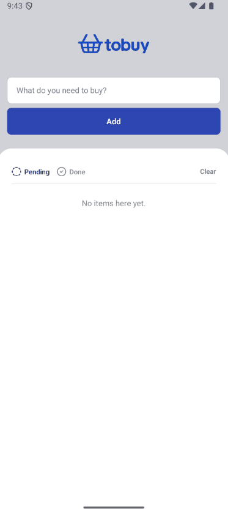

# ToBuyApp

A simple, minimalist shopping list mobile app built with Expo and React Native. Organize your grocery or shopping needs by adding items, marking them as bought, and filtering your list by status.

## Features

- **Add Items:** Quickly add new items to your list using a straightforward input and button.
- **Mark as Bought:** Toggle items between pending and bought states with a tap.
- **Filtering:** View all, pending, or completed items using filter buttons.
- **Persistent Storage:** Items are stored locally using AsyncStorage, so your list is saved between sessions.
- **Built with Expo:** Easy setup and cross-platform support (iOS, Android, and web).

## Demo

<p align="center">
  
</p>

## Installation

1. **Clone the repository:**

   ```bash
   git clone https://github.com/bmartins95/ToBuyApp.git
   cd ToBuyApp
   ```

2. **Install dependencies:**

   ```bash
   npm install
   # or
   yarn install
   ```

3. **Run the app with Expo:**

   ```bash
   npm run start
   # or
   expo start
   ```

4. **Launch on device/emulator:**

   - Press **a** for Android emulator.
   - Press **i** for iOS simulator.
   - Scan the QR code with Expo Go on your phone.

## Project Structure

```
ToBuyApp/
├── assets/                # Images, icons, and fonts
│   └── logo.png
├── src/
│   ├── app/
│   │   └── home.tsx       # Root component with UI and state management
│   ├── components/        # Reusable UI components (e.g., Filter, Item)
│   ├── hooks/             # Custom React hooks (if any)
│   ├── services/          # Data services (AsyncStorage wrapper)
│   ├── styles/            # StyleSheet definitions
│   └── types/             # TypeScript type definitions
├── .gitignore
├── app.json               # Expo configuration
├── index.ts               # Entry point registering Home component
├── package.json           # Project metadata and dependencies
├── tsconfig.json          # TypeScript configuration
└── README.md              # Project documentation
```

## Dependencies

- **expo** \~53.0.10
- **react** 19.0.0
- **react-native** 0.79.3
- **@react-native-async-storage/async-storage** 2.1.2
- **lucide-react-native** ^0.513.0
- **react-native-svg** 15.11.2

(See \[package.json] for full list of dependencies) ([github.com](https://github.com/bmartins95/ToBuyApp/raw/master/package.json))

## Contributing

Contributions are welcome! Feel free to open an issue or submit a pull request.

## License

This project is currently unlicensed. To add a license, create a LICENSE file in the root of the repository.

## Contact

For questions or feedback, reach out to Bruno Martins at [bruno.martins.cesfi@gmail.com](mailto:bruno.martins.cesfi@gmail.com).
